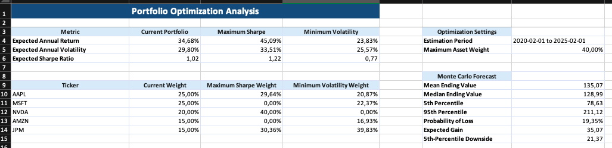
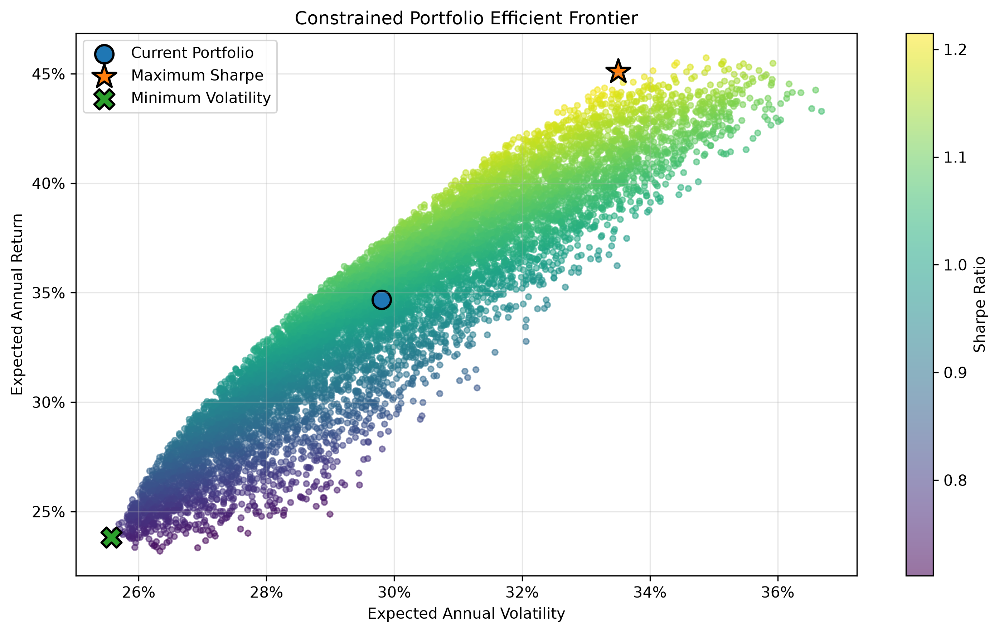
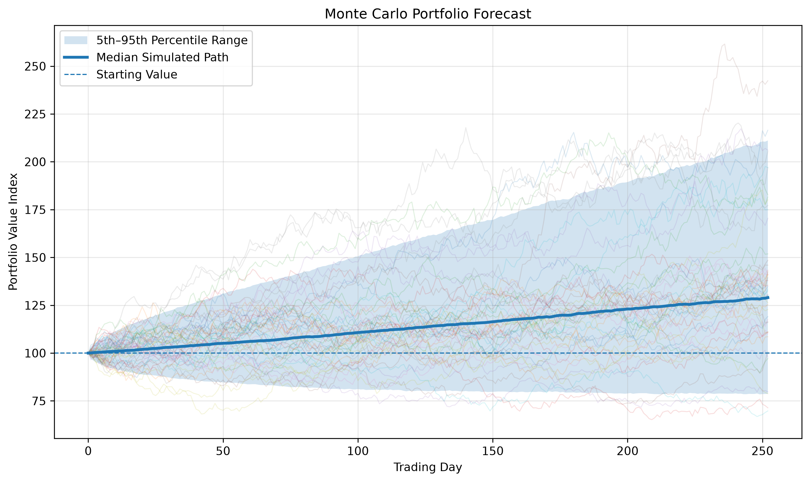

# Portfolio Analytics & Optimization Platform


A Python-based portfolio analytics platform combining performance measurement, risk analytics, portfolio optimization, Monte Carlo forecasting, stress testing, rebalancing analysis, interactive visualization, and automated Excel reporting.

The project demonstrates practical quantitative-finance and software-engineering techniques relevant to investment analysis, portfolio management, wealth management, capital markets, and financial data analytics.

---

## Core Capabilities

### Portfolio Performance

* Multi-asset portfolio analysis
* Total and annualized return
* Annualized volatility
* Sharpe, Sortino, Calmar, and Treynor ratios
* Maximum drawdown
* Asset contribution analysis
* Portfolio-value tracking
* Rolling volatility and rolling Sharpe ratio
* Benchmark comparison

### Risk and Benchmark Analytics

* Historical Value at Risk at 95% and 99%
* Historical Conditional Value at Risk at 95% and 99%
* Portfolio beta
* CAPM expected return
* Jensen’s alpha
* Active return
* Tracking error
* Information ratio
* Upside and downside capture ratios
* Asset-correlation analysis

### Portfolio Optimization

* Modern Portfolio Theory
* Mean-variance optimization
* Efficient-frontier simulation
* Maximum Sharpe portfolio
* Minimum-volatility portfolio
* Long-only allocation constraints
* Maximum position-size constraints
* Current and optimized allocation comparison

### Monte Carlo Forecasting

* Geometric Brownian Motion simulation
* 10,000 simulated portfolio paths
* Mean and median ending values
* Probability of loss
* Expected gain
* 5th- and 95th-percentile outcomes
* Downside risk estimation

### Stress Testing

* Broad market shock
* Technology-sector selloff
* Financial-sector shock
* Rate-sensitive growth shock
* Asset-level scenario assumptions
* Portfolio-level impact calculation

### Portfolio Rebalancing

* Current-weight estimation
* Target-versus-current allocation comparison
* Weight-drift calculation
* Threshold-based rebalancing signals
* Buy, sell, and hold recommendations
* Suggested trade weights

### Reporting and Visualization

* Interactive Streamlit dashboard
* Automated Excel workbook
* Processed portfolio-data export
* Efficient-frontier visualization
* Monte Carlo forecast chart
* Portfolio-value and drawdown charts
* Contribution and correlation visualizations
* Rolling-risk charts

---

## Interactive Dashboard

The Streamlit dashboard contains five pages:

1. **Overview** — portfolio performance, value history, and key insights
2. **Risk Analytics** — downside risk, benchmark metrics, and correlation analysis
3. **Optimization** — efficient frontier, optimized allocations, and Monte Carlo forecasting
4. **Stress Testing** — scenario assumptions and estimated portfolio impacts
5. **Rebalancing** — allocation drift and recommended portfolio trades

---

## Example Outputs

### Portfolio Optimization Report

The Excel report compares the current portfolio with the optimized Maximum Sharpe and Minimum Volatility portfolios while summarizing the Monte Carlo forecast.



### Efficient Frontier

The efficient frontier displays simulated feasible allocations and highlights the current portfolio, constrained Maximum Sharpe portfolio, and Minimum Volatility portfolio.



### Monte Carlo Forecast

The Monte Carlo model simulates 10,000 possible one-year portfolio paths. The chart displays the median simulated path and the 5th–95th percentile range.



---

## Financial Methodology

### Performance Measurement

The platform calculates portfolio returns from historical adjusted closing prices and evaluates performance using return, volatility, drawdown, contribution, and risk-adjusted performance metrics.

### Mean-Variance Optimization

Portfolio optimization follows Modern Portfolio Theory. The optimizer evaluates expected returns and the covariance matrix while enforcing:

* Full investment, with weights summing to 100%
* Long-only allocations
* Maximum position-size limits

The platform identifies the constrained Maximum Sharpe and Minimum Volatility portfolios and compares them with the current allocation.

### Historical Downside Risk

Value at Risk estimates a loss threshold at a selected confidence level. Conditional Value at Risk measures the average loss beyond that threshold, providing additional information about tail risk.

### Benchmark-Relative Risk

The platform compares portfolio performance with a market benchmark through beta, CAPM expected return, Jensen’s alpha, tracking error, information ratio, active return, and capture ratios.

CAPM, Jensen’s alpha, and the information ratio are shown as unavailable when the analysis period contains fewer than 252 daily observations.

### Monte Carlo Simulation

Future portfolio values are modeled using Geometric Brownian Motion based on annualized expected return and volatility. The simulation provides a distribution of potential outcomes rather than one deterministic forecast.

### Stress Testing

Predefined hypothetical shocks are applied to individual portfolio assets. Each scenario’s portfolio impact is calculated as the weighted sum of its asset-level assumptions.

### Rebalancing Analysis

Current portfolio weights are estimated from the relative movement of each holding since the beginning of the analysis period. The platform compares current and target weights and recommends trades when drift exceeds the configured threshold.

---

## Technology Stack

* **Python 3.13**
* **Pandas and NumPy** for data processing
* **SciPy** for constrained optimization
* **Matplotlib** for financial visualizations
* **Streamlit** for the interactive dashboard
* **OpenPyXL** for Excel reporting
* **yfinance** for historical market data
* **Git** for version control

---

## Project Architecture

| Component              | Purpose                                                                                    |
| ---------------------- | ------------------------------------------------------------------------------------------ |
| `app.py`               | Runs the interactive Streamlit dashboard.                                                  |
| `config.json`          | Stores portfolio, analysis, optimization, and simulation settings.                         |
| `src/analytics.py`     | Calculates performance, downside-risk, benchmark, stress-testing, and rebalancing metrics. |
| `src/download_data.py` | Downloads market data and risk-free rates and saves processed data.                        |
| `src/excel_report.py`  | Generates the formatted Excel report.                                                      |
| `src/monte_carlo.py`   | Simulates and summarizes future portfolio paths.                                           |
| `src/optimization.py`  | Performs portfolio simulation and constrained optimization.                                |
| `src/portfolio.py`     | Calculates portfolio returns, values, contributions, and correlations.                     |
| `src/run_analysis.py`  | Coordinates the complete analytics pipeline.                                               |
| `src/visualization.py` | Generates portfolio, risk, optimization, and forecasting charts.                           |

---

## Workflow

```text
Configuration
     |
     v
Market Data Download
     |
     v
Portfolio Performance Analysis
     |
     +-------------------+
     |                   |
     v                   v
Risk Analytics     Portfolio Optimization
     |                   |
     v                   v
Stress Testing     Monte Carlo Forecast
     |                   |
     +---------+---------+
               |
               v
     Rebalancing Analysis
               |
               v
   Dashboard, Charts, and Excel Report
```

---

## Installation

Clone the repository:

```bash
git clone https://github.com/Alisayli/portfolio-analytics-optimization-platform.git
cd portfolio-analytics-optimization-platform
```

Create a virtual environment:

```bash
python -m venv .venv
```

Activate it on macOS or Linux:

```bash
source .venv/bin/activate
```

Activate it on Windows:

```bash
.venv\Scripts\activate
```

Install the dependencies:

```bash
pip install -r requirements.txt
```

---

## Usage

### Interactive Dashboard

Launch the Streamlit application:

```bash
streamlit run app.py
```

Open the local address shown in the terminal, usually:

```text
http://localhost:8501
```

### Command-Line Analysis

Run the complete analytics pipeline:

```bash
python src/run_analysis.py
```

The pipeline downloads market data, calculates analytics, performs optimization and simulation, generates charts, exports processed data, and creates the Excel report.

### Configuration Overrides

The default settings are stored in `config.json`. Selected settings can also be overridden through command-line arguments:

```bash
python src/run_analysis.py \
  --start-date 2024-01-01 \
  --end-date 2025-01-01 \
  --benchmark SPY
```

A different configuration file can be supplied with:

```bash
python src/run_analysis.py --config path/to/config.json
```

---

## Repository Structure

```text
portfolio-analytics-optimization-platform/
├── app.py
├── config.json
├── data/
│   ├── raw/
│   └── processed/
├── images/
├── outputs/
│   ├── charts/
│   └── reports/
├── src/
│   ├── analytics.py
│   ├── download_data.py
│   ├── excel_report.py
│   ├── monte_carlo.py
│   ├── optimization.py
│   ├── portfolio.py
│   ├── run_analysis.py
│   ├── utils.py
│   └── visualization.py
├── .gitignore
├── LICENSE
├── README.md
└── requirements.txt
```

---

## Important Notes

* Results depend on historical market data and should not be interpreted as investment advice.
* Expected returns, optimized allocations, and Monte Carlo outcomes are model estimates rather than guaranteed future results.
* Yahoo Finance availability may vary. If Treasury-bill data are unavailable, the platform uses the fallback risk-free rate configured in `config.json`.
* Short analysis periods may produce unstable annualized estimates and may not provide enough observations for certain benchmark-relative metrics.

---

## Future Improvements

Potential future improvements include:

* Automated unit and integration tests
* Historical strategy backtesting
* Transaction-cost and tax-aware rebalancing
* User-configurable portfolio inputs within the dashboard
* Deployment of the Streamlit application

---

## Skills Demonstrated

### Finance

* Portfolio analytics
* Modern Portfolio Theory
* Mean-variance optimization
* Efficient-frontier analysis
* Risk-adjusted performance measurement
* Downside-risk analysis
* Benchmark-relative analysis
* Monte Carlo simulation
* Stress testing
* Portfolio rebalancing

### Technical

* Python
* Data analysis
* Scientific computing
* Constrained optimization
* Financial-data processing
* Interactive dashboard development
* Data visualization
* Excel automation
* Configuration-driven workflows
* Logging and error handling
* Modular software design
* Git version control

---

## Author

**Ali Sayli**

Economics (Finance) and Political Science
University of Toronto

Developed as part of a technical portfolio for investment analysis, portfolio management, capital markets, and financial analytics opportunities.

---

## License

This project is licensed under the MIT License.
